# RA1: Desarrolla aplicaciones que gestionan información almacenada en ficheros identificando el campo de aplicación de los mismos y utilizando clases específicas

---

## Módulo 1: Introducción al Almacenamiento y Gestión de Ficheros

### 1.1 Concepto de Fichero y Niveles de Abstracción
En el desarrollo de aplicaciones empresariales, la ingeniería de datos y la administración de sistemas, **los ficheros constituyen el mecanismo primario e indispensable para garantizar la persistencia de la información**. Permiten que los datos sobrevivan a la finalización de un programa o al apagado físico del hardware, sirviendo como puente de comunicación en el tiempo y el espacio.

Un fichero (o archivo) es una **unidad lógica de almacenamiento** de información direccionable que reside en un dispositivo físico secundario. Su naturaleza cambia según el nivel de abstracción desde el que se analice.

#### Diagrama de Niveles de Abstracción de un Fichero
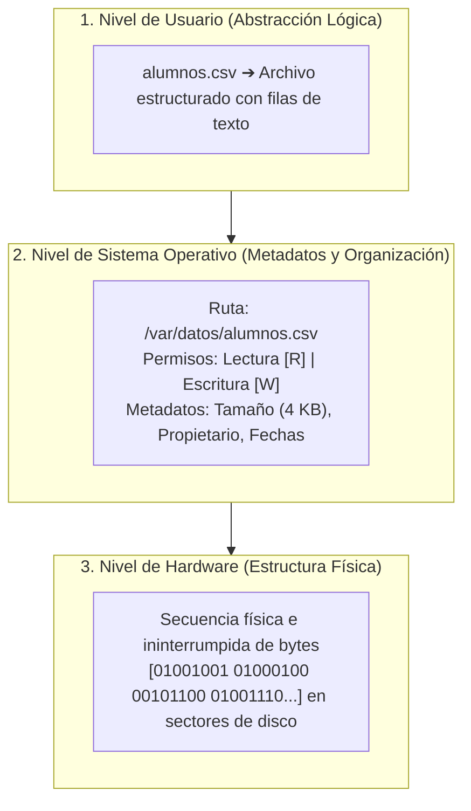

Todo fichero cuenta obligatoriamente con los siguientes componentes de control administrados por el sistema de archivos (*file system*):
* **Nombre e Identificador:** Cadena única que lo distingue dentro de un directorio.
* **Ruta de Acceso (Path):** La localización lógica jerárquica en el volumen de almacenamiento.
* **Permisos de Acceso:** Atributos de seguridad que determinan qué usuarios o procesos pueden leer, escribir o ejecutar el archivo.
* **Metadatos:** Información de control gestionada automáticamente por el sistema (tamaño exacto en bytes, autor/propietario, marcas de tiempo de creación y última modificación).

---

### 1.2 Evolución Tecnológica de la Persistencia
La interacción del software con los datos almacenados ha evolucionado a lo largo de tres grandes eras tecnológicas:

#### Diagrama de Evolución de la Persistencia
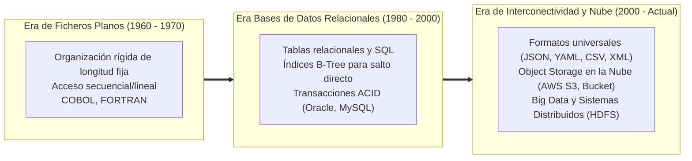

1. **Era de los Ficheros Planos (Flat Files):** Los datos se organizaban en registros y campos dentro de ficheros de texto o binarios sin índices globales. La manipulación era lineal y muy rígida.

#### Diagrama de Registro de Longitud Fija
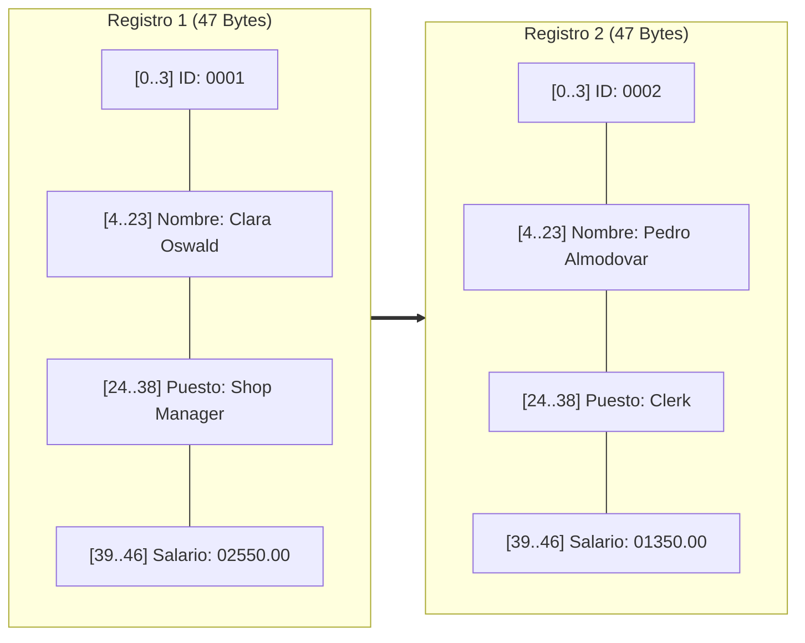

> **Inconveniente:** Para buscar al empleado con ID=2, el sistema debe leer obligatoriamente los 47 bytes del Registro 1.

2. **Era de las Bases de Datos Relacionales (RDBMS):** Sistemas como Oracle, MySQL o PostgreSQL aportaron consultas complejas (SQL), transacciones seguras (ACID) e índices B-Tree para saltos inmediatos sin recorrer todo el fichero.

#### Diagrama de Búsqueda mediante Índice B-Tree [Simulador de árboles B](https://meskeia.com/simulador-arboles-b/)
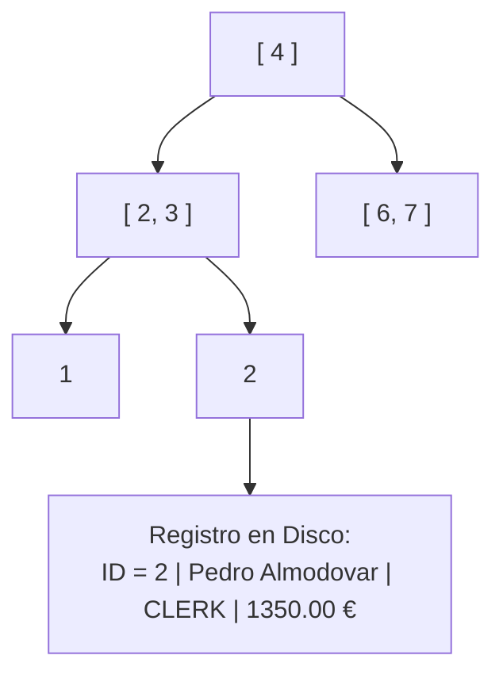

3. **Era de la Interconectividad y el Big Data:** Formatos universales legibles por humanos (CSV, XML, JSON, YAML) para APIs REST e intercambio entre sistemas heterogéneos, junto con almacenes de objetos en la nube (Amazon S3, Google Cloud Storage, Azure Blob Storage) o sistemas distribuidos como HDFS.

#### Diagrama de Formatos Universales de Intercambio
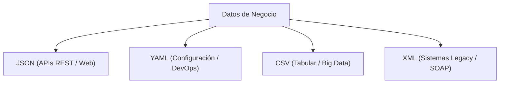

---

### 1.3 Áreas de Aplicación Actual de los Ficheros
En las arquitecturas de software modernas, los ficheros desempeñan un papel fundamental en áreas estratégicas:

* **Persistencia Básica:** Guardar información rápida sin necesidad de desplegar una base de datos.
* **Intercambio de Datos:** Enviar y recibir información entre plataformas heterogéneas mediante formatos estándar (CSV, JSON).
* **Logs y Auditoría:** Registrar de forma secuencial la actividad del sistema para tareas de depuración y seguridad (`access.log`).
* **Configuración de Aplicaciones:** Definir el comportamiento del sistema mediante ficheros legibles (`application.yaml`, `config.properties`).
* **Procesamiento Masivo:** Soporte esencial para Big Data, Machine Learning y procesos ETL (Extracción, Transformación y Carga).
* **Integración con la Nube:** Subir, descargar, versionar e interactuar con ficheros remotos de forma automatizada mediante APIs.

---

### 1.4 Almacenamiento en la Nube: Buckets y Object Storage
En lugar del árbol tradicional de directorios y carpetas de los discos locales, el almacenamiento en la nube se basa predominantemente en **Object Storage**.

#### Diagrama Comparativo: Sistema de Archivos vs. Object Storage
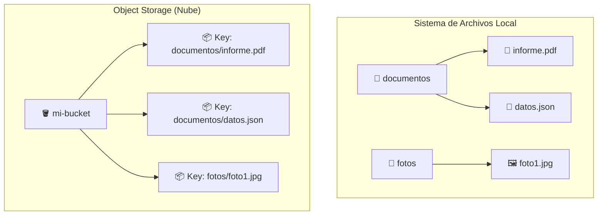

Un **Bucket** es un contenedor lógico en la nube donde cada archivo se guarda como un **Objeto** compuesto por:
* **Key (Clave):** Identificador único del objeto (ej. `fotos/foto1.jpg`).
* **Payload (Datos):** Contenido binario del archivo.
* **Metadatos:** Información clave-valor asociadas (tipo MIME, permisos, versión).

#### Diagrama de Integración Java Spring Boot con Amazon S3
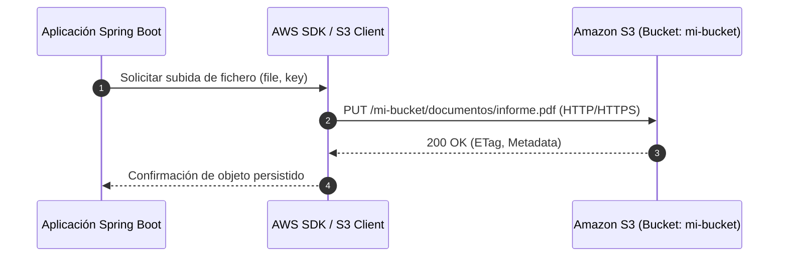

| Sistema de Archivos Local | Object Storage (Nube) |
| :--- | :--- |
| Carpetas y subcarpetas jerárquicas | Buckets y objetos planos con Key |
| Gestionado por el Sistema Operativo | Acceso remoto mediante API REST (HTTP/HTTPS) |
| Permite modificación parcial de bytes | Modificación mediante reemplazo completo del objeto |
| Ejemplos: NTFS, ext4, APFS | Ejemplos: Amazon S3, Google Cloud Storage |

---

## Módulo 2: Tipos de Ficheros según su Contenido

### 2.1 Ficheros de Texto
Están compuestos por bytes que representan **caracteres codificados bajo un estándar específico** (normalmente UTF-8).

* **Formatos representativos:** `.txt`, `.csv`, `.json`, `.xml`, `.yaml`.
* **Ventajas:** Altamente legibles por seres humanos, fáciles de editar con herramientas básicas y con portabilidad universal entre sistemas operativos.
* **Inconvenientes:** Consumen más espacio físico de almacenamiento y requieren parseo (traducción a objetos de memoria).

#### Ejemplo Práctico en Java: Escritura y Lectura de Texto con NIO.2
```java
package com.edu.aad.file;

import java.io.IOException;
import java.nio.charset.StandardCharsets;
import java.nio.file.Files;
import java.nio.file.Path;
import java.nio.file.Paths;

public class TextFileExample {

    public void processTextFile() {
        Path path = Paths.get("students.csv");

        try {
            String csvData = """
                ID,Name,Role
                1,Sophia,Developer
                2,Marcus,Project Manager
                """;

            Files.writeString(path, csvData, StandardCharsets.UTF_8);
            System.out.println("Fichero escrito correctamente: " + path.toAbsolutePath());

            String retrievedContent = Files.readString(path, StandardCharsets.UTF_8);
            System.out.println("--- Contenido recuperado ---");
            System.out.println(retrievedContent);

        } catch (IOException e) {
            System.err.println("Error al procesar el fichero de texto: " + e.getMessage());
        }
    }
}
```

---

### 2.2 Ficheros Binarios
Almacenan información en formato de **bytes raw**, codificados siguiendo una especificación técnica de bajo nivel.

#### Diagrama de Estructura Interna de un Fichero Binario
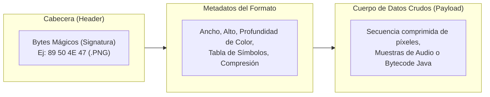

* **Formatos representativos:** Imágenes (`.png`, `.jpg`), audio (`.mp3`), ejecutables/bytecode (`.class`), comprimidos (`.zip`), modelos de IA (`.onnx`).
* **Ventajas:** Extremadamente compactos, eficientes en espacio y con lectura/escritura ultra rápida sin parseo de caracteres.
* **Inconvenientes:** Totalmente ilegibles sin el software específico. Un solo byte corrupto inutiliza el archivo completo.

#### Ejemplo Práctico en Java: Lectura Binaria Optimizada y Cálculo de Hashing
```java
package com.edu.aad.file;

import java.io.BufferedInputStream;
import java.io.File;
import java.io.FileInputStream;
import java.io.IOException;
import java.security.MessageDigest;
import java.security.NoSuchAlgorithmException;
import java.util.HexFormat;

public class BinaryFileExample {

    public void processBinaryFile(String filename) {
        File file = new File(filename);

        if (!file.exists()) {
            System.err.println("No se encuentra el fichero binario: " + filename);
            return;
        }

        try (BufferedInputStream input = new BufferedInputStream(new FileInputStream(file))) {
            MessageDigest digest = MessageDigest.getInstance("SHA-256");
            byte[] buffer = new byte[4096];
            int bytesRead;

            while ((bytesRead = input.read(buffer)) != -1) {
                digest.update(buffer, 0, bytesRead);
            }

            String hash = HexFormat.of().formatHex(digest.digest());
            System.out.println("Fichero: " + file.getName());
            System.out.println("Tamaño: " + (file.length() / 1024) + " KB");
            System.out.println("SHA-256: " + hash);

        } catch (IOException | NoSuchAlgorithmException e) {
            System.err.println("Error procesando fichero binario: " + e.getMessage());
        }
    }
}
```

---

### 2.3 Formatos Híbridos Modernos y Codificación Base64
Formatos como `.docx`, `.xlsx` o `.pptx` son en realidad **contenedores ZIP** que integran archivos XML estructurados y recursos binarios (imágenes, fuentes).

#### Diagrama de Estructura de un Documento DOCX
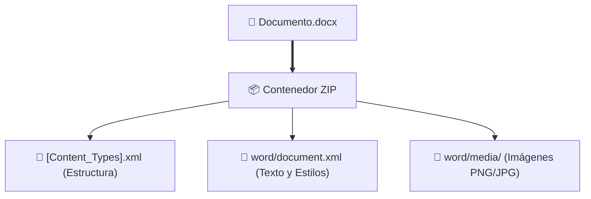

#### Codificación Base64
Cuando es necesario transportar datos binarios a través de protocolos o formatos diseñados exclusivamente para texto (como JSON en APIs REST), se utiliza la codificación **Base64**, que convierte secuencias de bytes en cadenas de caracteres imprimibles.

#### Diagrama de Flujo del Transporte Base64
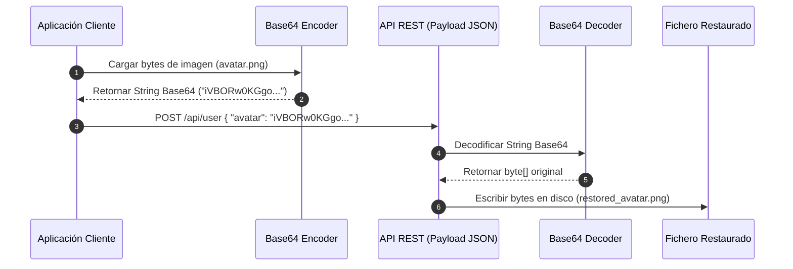

> **Atención:** Base64 **no es un algoritmo de cifrado ni de compresión**. De hecho, incrementa el tamaño de los datos aproximadamente un **33%**.

#### Ejemplo Práctico en Java: Codificación y Decodificación Base64
```java
package com.edu.aad.file;

import java.io.IOException;
import java.nio.file.Files;
import java.nio.file.Path;
import java.util.Base64;

public class Base64Example {

    public void processBase64(Path imagePath, Path restoredPath) {
        if (!Files.exists(imagePath)) {
            System.err.println("El fichero no existe: " + imagePath);
            return;
        }

        try {
            byte[] binaryData = Files.readAllBytes(imagePath);
            System.out.println("Tamaño original: " + binaryData.length + " bytes");

            // Codificar bytes a cadena Base64
            String base64String = Base64.getEncoder().encodeToString(binaryData);
            System.out.println("Tamaño en Base64: " + base64String.length() + " caracteres");

            // Decodificar Base64 de vuelta a bytes
            byte[] restoredData = Base64.getDecoder().decode(base64String);
            Files.write(restoredPath, restoredData);

            System.out.println("Fichero restaurado con éxito en: " + restoredPath);

        } catch (IOException e) {
            System.err.println("Error procesando Base64: " + e.getMessage());
        }
    }
}
```

---

### 2.4 Codificaciones de Texto: De Bytes a Caracteres y Mojibake
El texto en disco no guarda letras, sino números (bytes). La **codificación** establece la tabla de traducción entre esos bytes y los caracteres gráficos.

#### Diagrama del Proceso de Codificación / Decodificación
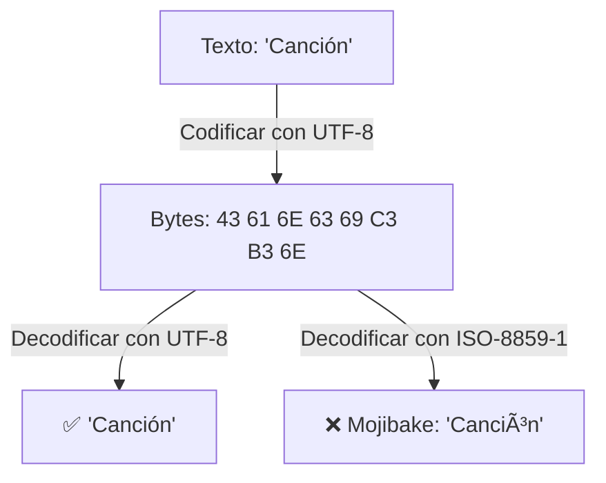

#### UTF-8 como Estándar Universal
UTF-8 utiliza una longitud variable de **1 a 4 bytes por carácter**, garantizando compatibilidad total con ASCII en su primer byte y soporte para todos los alfabetos del mundo (español, chino, japonés, emojis).

#### Ejemplo Práctico en Java: Especificación Explícita de UTF-8
```java
package com.edu.aad.file;

import java.io.IOException;
import java.nio.charset.StandardCharsets;
import java.nio.file.Files;
import java.nio.file.Path;

public class EncodingExample {

    public void writeAndReadUtf8(Path path) {
        try {
            String text = "¡Hola! Canción, España, 数据库, こんにちは 🚀";

            // Escritura explícita en UTF-8
            Files.writeString(path, text, StandardCharsets.UTF_8);

            // Lectura explícita en UTF-8
            String content = Files.readString(path, StandardCharsets.UTF_8);
            System.out.println("Contenido leído correctamente: " + content);

        } catch (IOException e) {
            System.err.println("Error de I/O gestionando codificación: " + e.getMessage());
        }
    }
}
```

---

## Módulo 3: Acceso Clásico (`java.io`) vs. Acceso Moderno (`java.nio`)

### 3.1 La API Clásica (`java.io.File`)
La clase `java.io.File` representa la ubicación de una ruta dentro del sistema de archivos. **Crear un objeto `File` no abre ni lee el archivo**, únicamente manipula sus metadatos.

#### Diagrama de Arquitectura de la API Clásica vs. Moderna
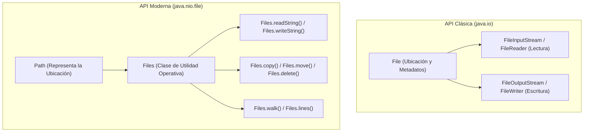

#### Métodos Clave de `java.io.File`
* `exists()`: Comprueba la existencia del recurso.
* `isFile()` / `isDirectory()`: Determina la naturaleza del recurso.
* `mkdir()` vs `mkdirs()`: `mkdir()` crea solo el último directorio; `mkdirs()` crea toda la estructura jerárquica intermedia si no existe.

---

### 3.2 La API Moderna (`java.nio.file`: `Path` + `Files`)
Introducida en NIO.2, separa de forma limpia las responsabilidades:
* **`Path` (Interfaz):** Define únicamente **DÓNDE** está el recurso en el sistema de archivos de forma independiente al Sistema Operativo.
* **`Files` (Clase de Utilidad):** Contiene todos los métodos estáticos para **QUÉ HACER** con ese recurso (leer, escribir, copiar, mover, eliminar, inspeccionar).

#### Diagrama de Responsabilidades en NIO.2
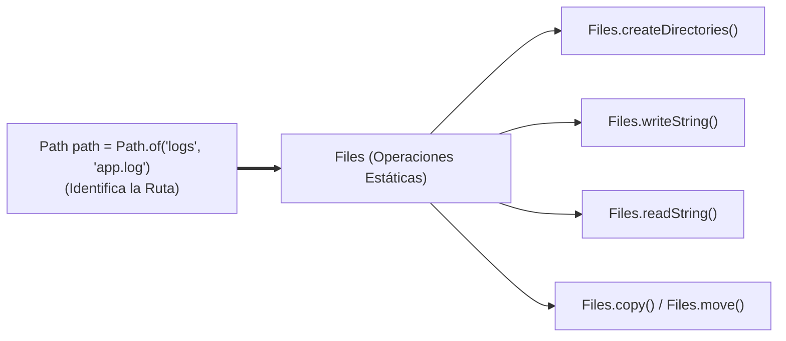

#### Ejemplo Práctico en Java: Creación y Gestión de Logs con NIO.2
```java
package com.edu.aad.file;

import java.io.IOException;
import java.nio.file.Files;
import java.nio.file.Path;
import java.nio.file.StandardOpenOption;

public class NioLogExample {

    public void writeLogEntry(String message) {
        Path logFile = Path.of("logs", "application.log");

        try {
            // Crear directorios padres si no existen
            if (logFile.getParent() != null) {
                Files.createDirectories(logFile.getParent());
            }

            // Escribir añadiendo al final (APPEND)
            Files.writeString(
                logFile,
                message + System.lineSeparator(),
                StandardOpenOption.CREATE,
                StandardOpenOption.APPEND
            );

            System.out.println("Log registrado en: " + logFile.toAbsolutePath());
            System.out.println("Tamaño actual: " + Files.size(logFile) + " bytes");

        } catch (IOException e) {
            System.err.println("Error al escribir el archivo de log: " + e.getMessage());
        }
    }
}
```

---

### 3.3 Recorrido de Arboles de Directorios con `Files.walk()`
NIO.2 integra soporte nativo con la API de Streams de Java para realizar búsquedas e inspecciones recursivas en sistemas de archivos.

#### Diagrama de Procesamiento de Directorios con `Files.walk()`
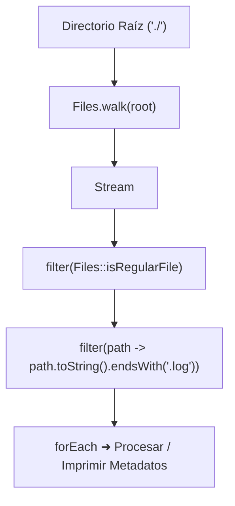

#### Ejemplo Práctico en Java: Buscador de Archivos de Log
```java
package com.edu.aad.file;

import java.io.IOException;
import java.nio.file.Files;
import java.nio.file.Path;
import java.util.stream.Stream;

public class DirectoryWalkerExample {

    public void findLogFiles(Path rootDir) {
        try (Stream<Path> paths = Files.walk(rootDir)) {
            paths.filter(Files::isRegularFile)
                 .filter(path -> path.toString().endsWith(".log"))
                 .forEach(path -> {
                     try {
                         System.out.printf("%s | %d bytes%n", 
                             path.toAbsolutePath(), Files.size(path));
                     } catch (IOException e) {
                         System.err.println("Error obteniendo tamaño de " + path);
                     }
                 });
        } catch (IOException e) {
            System.err.println("Error al recorrer el directorio: " + e.getMessage());
        }
    }
}
```

---

## Módulo 4: Formas de Acceso a Ficheros

### 4.1 Acceso Secuencial vs. Acceso Aleatorio o Directo
La estrategia de acceso define cómo la aplicación localiza y lee la información dentro del fichero.

#### Diagrama de Estrategias de Acceso
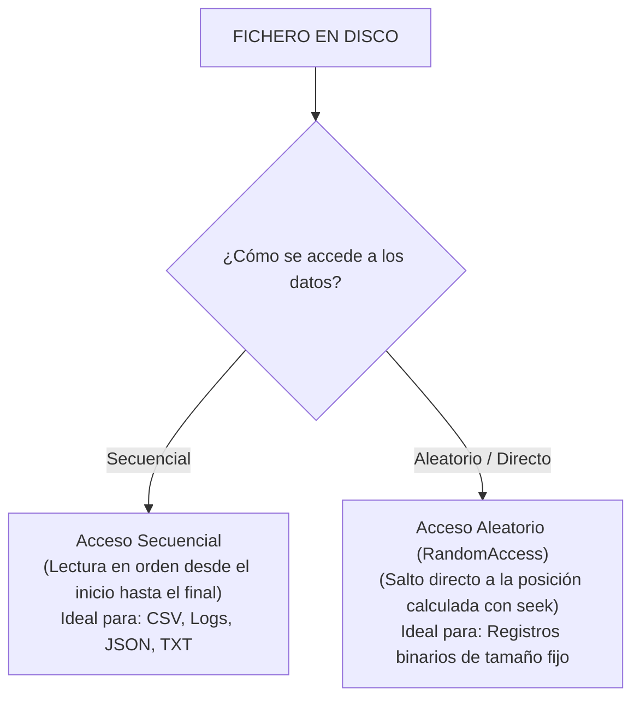

#### Comparativa de Estrategias
| Característica | Acceso Secuencial | Acceso Aleatorio (Directo) |
| :--- | :--- | :--- |
| **Mecanismo** | Lectura progresiva en orden | Salto directo mediante puntero (`seek`) |
| **Clase Representativa** | `Files.lines()`, `BufferedReader` | `RandomAccessFile`, `FileChannel` |
| **Estructura Requerida** | Delimitadores de línea o formato variable | Registros con tamaño fijo (bytes predecibles) |
| **Eficiencia de Búsqueda** | $O(N)$ (debe recorrer los elementos previos) | $O(1)$ (cálculo directo de desplazamiento) |

---

### 4.2 Búsqueda y Modificación In-Situ con Registros de Tamaño Fijo
Cuando los registros tienen una longitud constante en bytes, la posición de cualquier registro se calcula mediante una fórmula aritmética sencilla:

$$\text{Posición} = \text{Número de Registro} \times \text{Tamaño del Registro}$$

$$\text{Posición del Campo} = (\text{Número de Registro} \times \text{Tamaño del Registro}) + \text{Desplazamiento del Campo}$$

#### Diagrama de Posicionamiento con `RandomAccessFile`
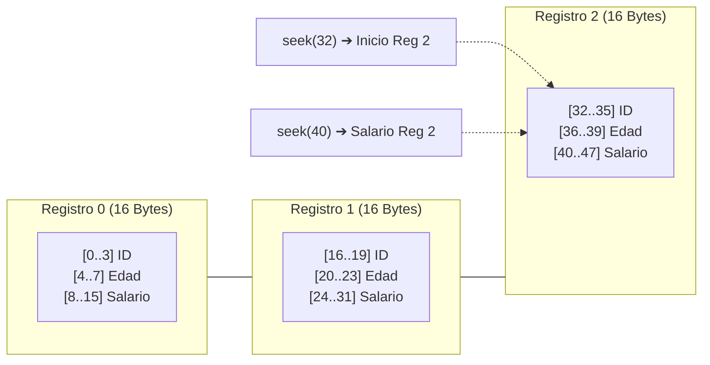

#### Ejemplo Práctico en Java: Modificación de Registro con `RandomAccessFile`
```java
package com.edu.aad.file;

import java.io.IOException;
import java.io.RandomAccessFile;
import java.nio.file.Path;

public class RandomAccessExample {

    private static final int RECORD_SIZE = 16; // 4 bytes (ID) + 4 bytes (Edad) + 8 bytes (Salario)

    public void updateSalary(Path path, int recordIndex, double newSalary) {
        try (RandomAccessFile raf = new RandomAccessFile(path.toFile(), "rw")) {
            
            // Posición base del registro
            long recordPosition = (long) recordIndex * RECORD_SIZE;
            
            // El campo salario tiene un desplazamiento de 8 bytes (tras ID y Edad)
            long salaryPosition = recordPosition + 8;

            if (salaryPosition + 8 > raf.length()) {
                System.err.println("El registro especificado está fuera de los límites del archivo.");
                return;
            }

            // Salto directo a la posición del salario sin leer registros anteriores
            raf.seek(salaryPosition);
            raf.writeDouble(newSalary);

            System.out.printf("Salario del registro %d actualizado a %.2f € en la posición %d%n",
                recordIndex, newSalary, salaryPosition);

        } catch (IOException e) {
            System.err.println("Error en acceso aleatorio al fichero: " + e.getMessage());
        }
    }
}
```

---

## Módulo 5: El Ciclo de Vida de las Operaciones sobre Ficheros

### 5.1 Fases del Ciclo de Vida y Gestión de Recursos
Toda interacción con un fichero sigue una secuencia estricta que requiere la liberación adecuada de descriptores de archivo para evitar **fugas de recursos** (*Resource Leaks*).

#### Diagrama de Ciclo de Vida de Operaciones sobre Ficheros
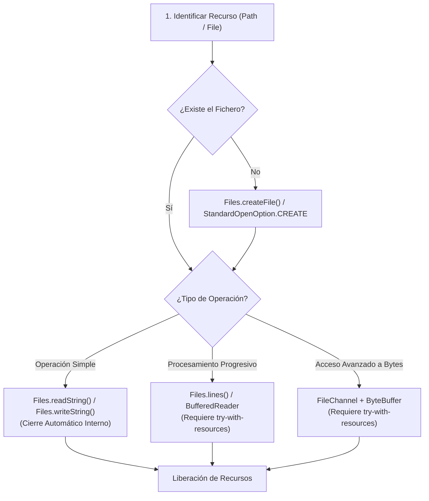

---

### 5.2 Operaciones Avanzadas con `FileChannel` y `ByteBuffer`
Para un control fino de memoria y rendimiento en I/O binario, Java NIO utiliza canales (`FileChannel`) y buffers de memoria directa (`ByteBuffer`).

#### Diagrama de Intercambio `FileChannel` y `ByteBuffer`
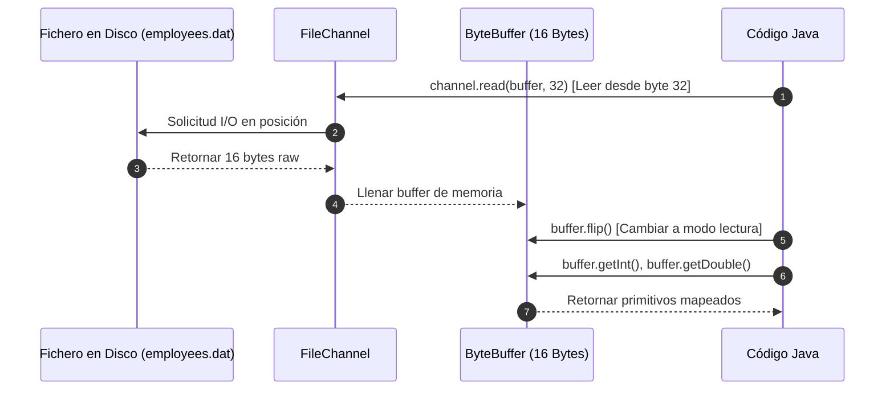

#### Ejemplo Práctico en Java: Lectura de Posición Específica con `FileChannel`
```java
package com.edu.aad.file;

import java.io.IOException;
import java.nio.ByteBuffer;
import java.nio.channels.FileChannel;
import java.nio.file.Path;
import java.nio.file.StandardOpenOption;

public class FileChannelExample {

    public void readRecordAtPosition(Path path, long bytePosition) {
        try (FileChannel channel = FileChannel.open(path, StandardOpenOption.READ)) {
            ByteBuffer buffer = ByteBuffer.allocate(16);

            int bytesRead = channel.read(buffer, bytePosition);

            if (bytesRead == 16) {
                buffer.flip(); // Prepara el buffer para extraer datos

                int id = buffer.getInt();
                int age = buffer.getInt();
                double salary = buffer.getDouble();

                System.out.printf("Empleado en posición %d: ID=%d, Edad=%d, Salario=%.2f €%n",
                    bytePosition, id, age, salary);
            } else {
                System.out.println("No se pudo leer un registro completo en la posición indicativa.");
            }

        } catch (IOException e) {
            System.err.println("Error trabajando con FileChannel: " + e.getMessage());
        }
    }
}
```

---

### 5.3 Garantía de Cierre Automático con `try-with-resources`
Cualquier recurso que implemente la interfaz `AutoCloseable` debe ser gestionado mediante la estructura `try-with-resources` para garantizar su cierre automático al salir del bloque, incluso si se producen excepciones.

```java
// Estructura recomendada en Java moderno
try (BufferedWriter writer = Files.newBufferedWriter(path, StandardCharsets.UTF_8, StandardOpenOption.APPEND)) {
    writer.write("Nueva entrada de registro");
    writer.newLine();
} catch (IOException e) {
    System.err.println("Error de escritura: " + e.getMessage());
}
// Al llegar aquí, el escritor 'writer' se ha cerrado automáticamente
```

---

## Módulo 6: Flujos de Datos: Streams, Buffers y Patrón Decorador

### 6.1 Concepto de Stream y Clasificación de Flujos
Un **Stream** (en I/O) representa la tubería o canal por el que viajan los datos en tránsito entre la aplicación Java y una fuente/destino externa.

#### Diagrama de Clasificación de Flujos de I/O
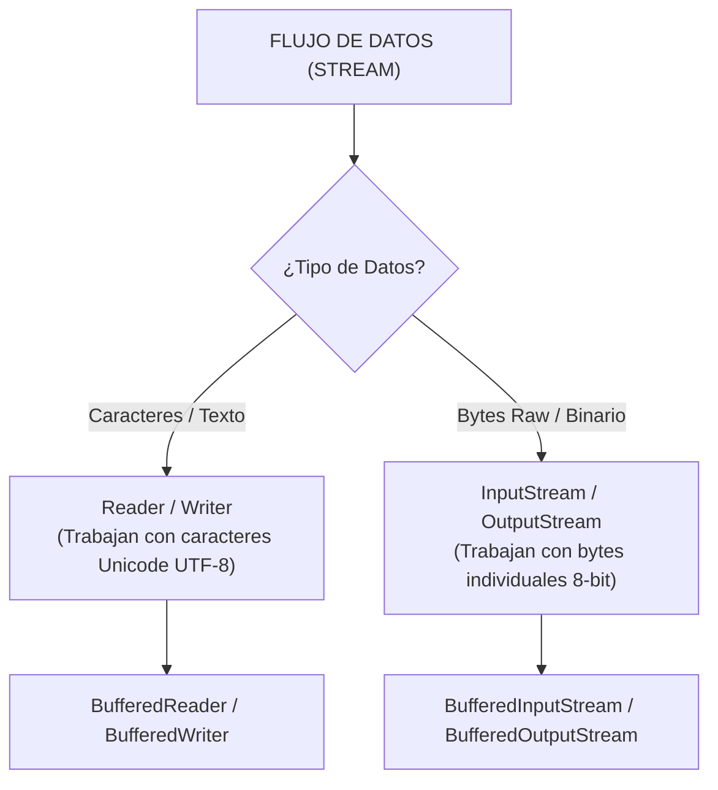

---

### 6.2 Buffering y Reducción de Latencia de I/O
Acceder al disco físico o a la red por cada byte individual es extremadamente lento. Un **Buffer** es una memoria intermedia en RAM que acumula bloques de datos para realizar transferencias masivas.

#### Diagrama del Mecanismo de Buffering
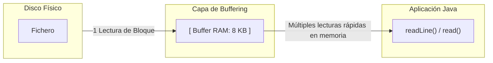

---

### 6.3 El Patrón Decorador en `java.io`
Java utiliza el patrón de diseño **Decorator** para componer dinámicamente funcionalidades sobre los flujos de datos envolviendo unas clases dentro de otras.

#### Diagrama de Capas del Patrón Decorador en Java I/O
```mermaid
graph TD
    subgraph Decorator["BufferedReader (Añade buffer de 8KB y método readLine)"]
        subgraph Intermediate["InputStreamReader (Convierte bytes a caracteres usando UTF-8)"]
            subgraph Base["InputStream / FileInputStream (Obtiene bytes crudos del archivo)"]
                Bytes["Bytes Crudos"]
            end
        end
    end
```

#### Código Java Equivalente
```java
// Composición manual mediante Decoradores
BufferedReader reader = new BufferedReader(
    new InputStreamReader(
        Files.newInputStream(path), 
        StandardCharsets.UTF_8
    )
);
```

---

### 6.4 Construcción Simplificada Moderna con NIO.2
En aplicaciones actuales no es necesario envolver manualmente todas las capas. La clase `Files` proporciona métodos de alto nivel que encapsulan el patrón Decorador automáticamente:

```java
package com.edu.aad.file;

import java.io.BufferedReader;
import java.io.BufferedWriter;
import java.io.IOException;
import java.nio.charset.StandardCharsets;
import java.nio.file.Files;
import java.nio.file.Path;

public class ModernStreamExample {

    public void readAndWrite(Path inputPath, Path outputPath) {
        // Lectura cómoda con BufferedReader autoconfigurado
        try (BufferedReader reader = Files.newBufferedReader(inputPath, StandardCharsets.UTF_8);
             BufferedWriter writer = Files.newBufferedWriter(outputPath, StandardCharsets.UTF_8)) {

            String line;
            while ((line = reader.readLine()) != null) {
                writer.write(line.toUpperCase());
                writer.newLine();
            }

            System.out.println("Procesamiento de flujo completado con éxito.");

        } catch (IOException e) {
            System.err.println("Error procesando flujos: " + e.getMessage());
        }
    }
}
```

---

## Módulo 7: Seguridad y Confidencialidad: Cifrado de Ficheros

### 7.1 Cifrado Simétrico
El **cifrado simétrico** utiliza una única clave secreta compartida tanto para cifrar como para descifrar el fichero.

#### Diagrama de Cifrado Simétrico
```mermaid
graph LR
    P1["📄 Fichero Original (mensaje.txt)"] -->|🔑 Clave Secreta + Algoritmo AES-256| Enc["🔐 Fichero Cifrado (mensaje.txt.gpg)"]
    Enc -->|🔑 Misma Clave Secreta| P2["📄 Fichero Restaurado (mensaje.txt)"]
```

#### Comandos Habituales de Cifrado Simétrico con GPG
```bash
# Cifrar un archivo de forma simétrica con AES-256
gpg --symmetric --cipher-algo AES256 mensaje.txt

# Descifrar el archivo recuperando el contenido original
gpg --decrypt mensaje.txt.gpg > mensaje_restaurado.txt
```

---

### 7.2 Cifrado Asimétrico (Par de Claves Pública y Privada)
El **cifrado asimétrico** resuelve el problema de la distribución de claves utilizando un par de claves matemáticamente vinculadas:
* **Clave Pública:** Se comparte libremente y se utiliza únicamente para **CIFRAR**.
* **Clave Privada:** Se mantiene en secreto absoluto y se utiliza únicamente para **DESCIFRAR**.

#### Diagrama de Transmisión Segura con Cifrado Asimétrico
```mermaid
sequenceDiagram
    autonumber
    participant A as Usuario A (Emisor / Alumno A)
    participant B as Usuario B (Receptor / Alumno B)

    Note over A,B: Paso 1: Intercambio de Claves Públicas
    B-->>A: Envía su Clave Pública B
    A-->>B: Envía su Clave Pública A
    
    Note over A: Paso 2: Cifrado en Origen
    A->>A: Escribe mensaje.txt
    A->>A: Cifra mensaje.txt usando la Clave Pública B
    
    Note over A,B: Paso 3: Envío por Canal No Seguro
    A->>B: Transmite mensaje.txt.gpg
    
    Note over B: Paso 4: Descifrado en Destino
    B->>B: Descifra el archivo usando su Clave Privada B
    B->>B: Recupera el mensaje.txt original
```

---

### 7.3 Actividad Práctica de Aula: Cifrado y Descifrado Asimétrico en Parejas

#### Herramientas Necesarias:
* **Kleopatra Neo / OpenPGP** (disponible en [Kleopatra](https://kleopatra.app/)) o cliente de línea de comandos `gpg`.

#### Diagrama de Flujo del Taller Práctico en Parejas
```mermaid
graph TD
    subgraph AlumnoA["👨‍💻 Alumno A"]
        GenA["1. Generar Par de Claves (Pública A / Privada A)"]
        ExpA["2. Exportar Clave Pública A"]
        ImpB["3. Importar Clave Pública B"]
        WriteA["4. Escribir mensaje_para_B.txt"]
        EncryptA["5. Cifrar archivo con Clave Pública B"]
        SendA["6. Enviar mensaje_para_B.txt.gpg a Alumno B"]
        RecvB["7. Recibir mensaje_para_A.txt.gpg"]
        DecryptA["8. Descifrar con su Clave Privada A"]
    end

    subgraph AlumnoB["👩‍💻 Alumno B"]
        GenB["1. Generar Par de Claves (Pública B / Privada B)"]
        ExpB["2. Exportar Clave Pública B"]
        ImpA["3. Importar Clave Pública A"]
        WriteB["4. Escribir mensaje_para_A.txt"]
        EncryptB["5. Cifrar archivo con Clave Pública A"]
        SendB["6. Enviar mensaje_para_A.txt.gpg a Alumno A"]
        RecvA["7. Recibir mensaje_para_B.txt.gpg"]
        DecryptB["8. Descifrar con su Clave Privada B"]
    end

    ExpA -->|Intercambio de Clave Pública| ImpA
    ExpB -->|Intercambio de Clave Pública| ImpB
    SendA -->|Canal de Red / Moodle / USB| RecvA
    SendB -->|Canal de Red / Moodle / USB| RecvB
```

#### Guía Paso a Paso para la Realización en Clase:

##### Fase 1: Generación del Par de Claves
1. Abrir **Kleopatra** (o ejecutar `gpg --full-generate-key`).
2. Crear un nuevo par de claves personal introduciendo Nombre y Correo Electrónico.
3. Proteger la **Clave Privada** mediante una frase de paso (*passphrase*).
4. **Regla de Oro:** La Clave Privada NUNCA se comparte ni sale del equipo personal.

##### Fase 2: Intercambio de Claves Públicas
1. Exportar la **Clave Pública** a un archivo (`.asc` o `.pub`).
2. Compartir la Clave Pública con el compañero de pareja (mediante carpeta compartida, chat interno o Moodle).
3. Importar la Clave Pública del compañero dentro de Kleopatra y marcarla como **confiada**.

##### Fase 3: Cifrado y Envío del Fichero
1. Crear un fichero de texto plano `mensaje_para_compañero.txt` con un contenido secreto.
2. En Kleopatra, seleccionar la opción **Cifrar / Firmar Archivos**.
3. Seleccionar como destinatario la **Clave Pública del compañero**.
4. Generar el fichero cifrado resultante (`mensaje_para_compañero.txt.gpg`).
5. Enviar el fichero cifrado al compañero a través de cualquier medio no seguro.

##### Fase 4: Descifrado y Lectura del Mensaje
1. El alumno receptor descarga el fichero `.gpg`.
2. En Kleopatra, seleccionar **Descifrar / Verificar**.
3. Introducir la frase de paso personal para desbloquear su **Clave Privada**.
4. Verificar que el fichero original se restaura e inspeccionar el contenido del mensaje.

---

### 7.4 Resumen de Principios de Cifrado

| Propiedad | Cifrado Simétrico | Cifrado Asimétrico |
| :--- | :--- | :--- |
| **Claves utilizadas** | 1 única clave compartida | Par de claves (1 Pública + 1 Privada) |
| **Velocidad de procesamiento** | Muy rápido (eficiente para ficheros grandes) | Más lento computacionalmente |
| **Caso de uso principal** | Protección de backups locales / disco | Intercambio seguro de datos entre usuarios |
| **Herramientas representativas** | GPG `--symmetric`, AES-256 | OpenPGP, Kleopatra, RSA / ECC |
