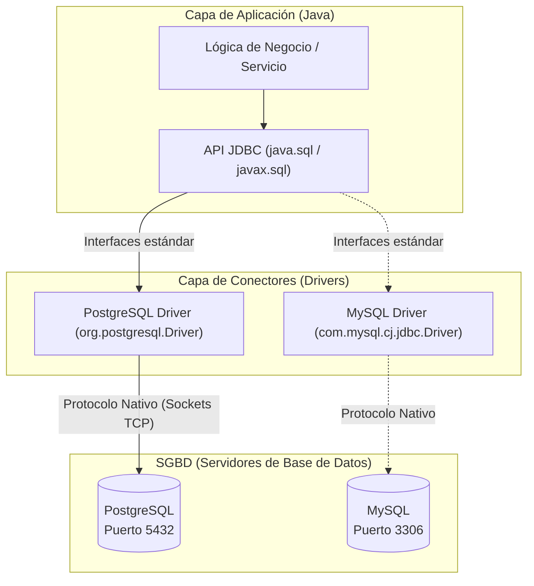
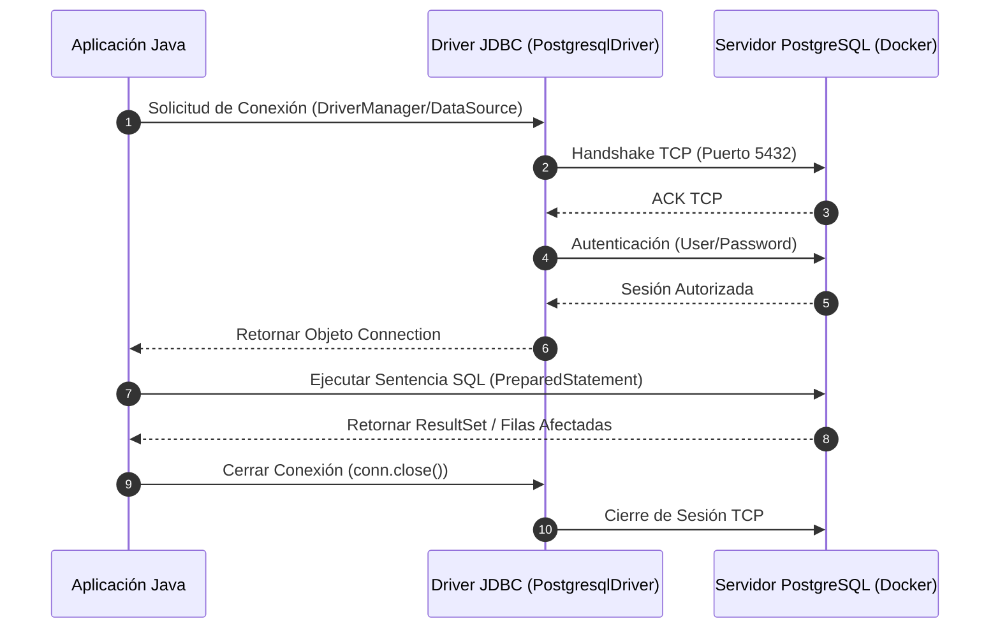
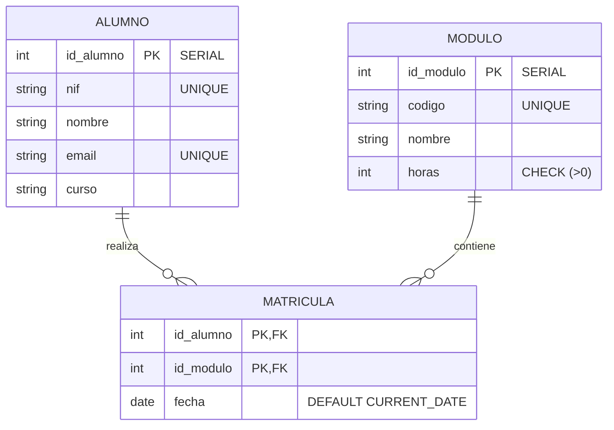
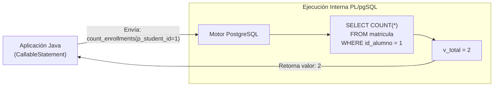
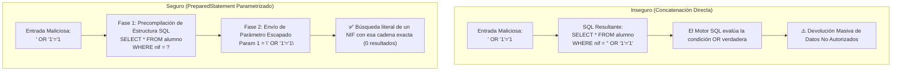
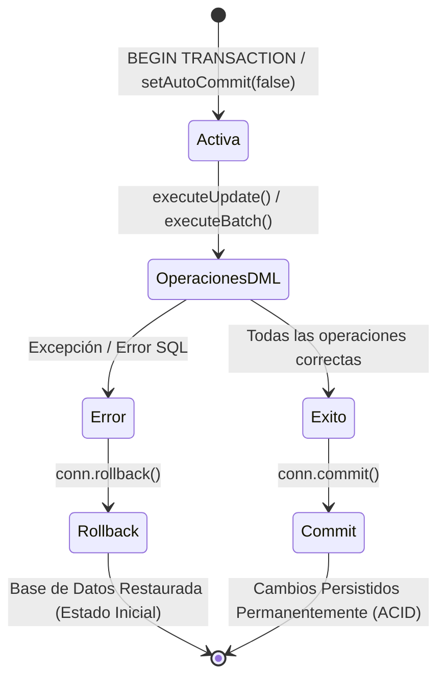
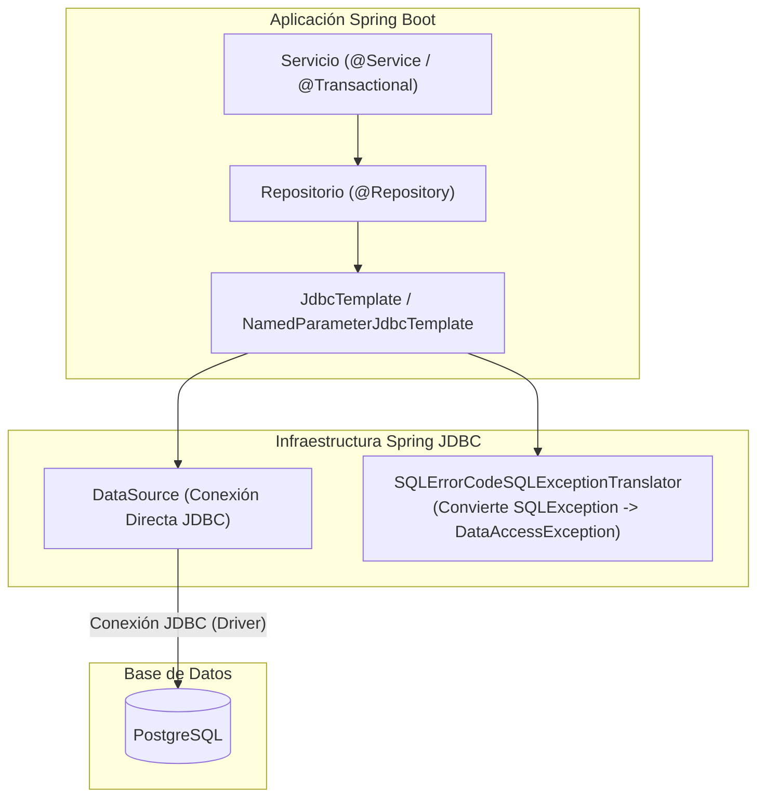
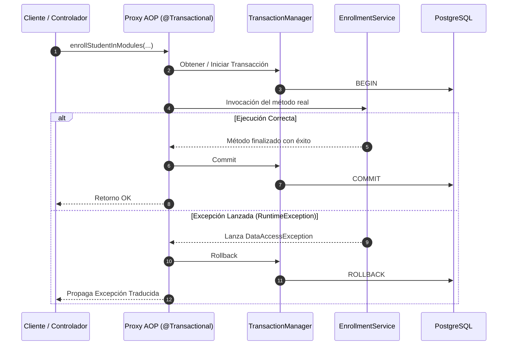

# RA2: Manejo de Conectores y Acceso a Datos en Java

---

## Módulo 1: Introducción a los Conectores y Arquitectura de Persistencia

### 1.1 Concepto de Conector y Capa de Abstracción JDBC
En el desarrollo de aplicaciones empresariales, la persistencia de datos es el mecanismo que permite almacenar la información más allá del tiempo de ejecución de la memoria RAM. Para interactuar con un Sistema Gestor de Bases de Datos Relacionales (SGBD) como PostgreSQL, una aplicación escrita en Java requiere un componente mediador denominado **conector** o **driver**.

Un **conector** es una biblioteca de software que actúa como traductor entre las llamadas a métodos del lenguaje de programación y el protocolo de red nativo del SGBD.

#### Diagrama de Arquitectura de Persistencia


En el ecosistema Java, la interacción con bases de datos relacionales está estandarizada a través de la **API JDBC** (`java.sql` y `javax.sql`). JDBC no es la implementación del conector en sí, sino una especificación de interfaces que los fabricantes de bases de datos implementan en sus respectivos paquetes JAR:

| Base de Datos | Driver Class | Artefacto Maven |
| :--- | :--- | :--- |
| **PostgreSQL** | `org.postgresql.Driver` | `org.postgresql:postgresql` |
| **MySQL** | `com.mysql.cj.jdbc.Driver` | `com.mysql:mysql-connector-j` |
| **Oracle** | `oracle.jdbc.OracleDriver` | `com.oracle.database.jdbc:ojdbc11` |

#### Ventajas e Inconvenientes del uso de Conectores
* **Ventajas:**
  * **Estandarización y Abstracción:** Permite cambiar el motor de base de datos subyacente modificando la cadena de conexión y la dependencia, manteniendo casi intacta la API de acceso.
  * **Aprovechamiento Nativo:** Permite ejecutar características específicas del SGBD (funciones almacenadas, tipos JSONB, comandos DDL avanzados).
  * **Seguridad y Rendimiento:** Soporte para consultas parametrizadas, transporte cifrado (SSL/TLS) y comunicación eficiente con la base de datos.
* **Inconvenientes:**
  * **Acoplamiento de Versiones:** El driver debe estar alineado con la versión del servidor de base de datos y la versión del JDK.
  * **Gestión de Recursos:** Las conexiones sin cerrar consumen descriptores de socket y memoria en el servidor, pudiendo saturar las conexiones disponibles en el servidor SGBD.
  * **Código Repetitivo (*Boilerplate*):** La gestión pura de JDBC requiere un control exhaustivo de excepciones y recursos.

---

### 1.2 Modelo Cliente-Servidor y Protocolos de Comunicación
En arquitecturas de producción, la base de datos se ejecuta de forma independiente a la aplicación. La comunicación entre el cliente JDBC y el servidor PostgreSQL sigue una secuencia estructurada sobre sockets TCP (puerto por defecto `5432`).

#### Diagrama de Secuencia del Handshake y Sesión JDBC


1. **Apertura de Socket TCP:** El driver inicia el *handshake* de red con el host y puerto especificados.
2. **Autenticación:** Intercambio de credenciales (usuario y contraseña) usando cifrado.
3. **Establecimiento de Sesión:** El servidor asigna un proceso o hilo de ejecución para atender las consultas de esa conexión.
4. **Intercambio de Mensajes:** Envíos de sentencias SQL y recepción de conjuntos de resultados (*ResultSets*) o códigos de estado.
5. **Cierre de Sesión:** Liberación de recursos tanto en cliente como en servidor.

---

### 1.3 Entorno Integrado con Docker Compose y PostgreSQL
Para garantizar un entorno de desarrollo aislado, reproducible y homogéneo, la infraestructura de la base de datos se despliega mediante **Docker Compose**.

#### Archivo `docker-compose.yml`
```yaml
services:
  postgres:
    image: postgres:15-alpine
    container_name: aad_postgres
    restart: always
    environment:
      POSTGRES_DB: aad_db
      POSTGRES_USER: postgres
      POSTGRES_PASSWORD: 1234
    ports:
      - "5432:5432"
    volumes:
      - pgdata:/var/lib/postgresql/data

volumes:
  pgdata:
```

#### Esquema del Entorno de Infraestructura Local
```
+-------------------------------------------------------------------------+
| HOST LOCAL (Máquina de Desarrollo)                                      |
|                                                                         |
|  +---------------------------+             +--------------------------+ |
|  | Aplicación Spring Boot    |             | Contenedor Docker        | |
|  | (JVM - Java)              |             | (aad_postgres)           | |
|  |                           |             |                          | |
|  | URL JDBC:                 |  TCP:5432   | +----------------------+ | |
|  | jdbc:postgresql://        |  ==========>| | Servidor PostgreSQL  | | |
|  | localhost:5432/aad_db     |             | | (aad_db:5432)        | | |
|  +---------------------------+             | +----------+-----------+ | |
|                                            +-----------|--------------+ |
|                                                        |                |
|                                                        v Volume         |
|                                            +--------------------------+ |
|                                            | Volumen Docker: pgdata   | |
|                                            | (Persistencia en disco)  | |
|                                            +--------------------------+ |
+-------------------------------------------------------------------------+
```

#### Parámetros de Conexión y Cadena JDBC
La **URL JDBC** identifica de manera unívoca la ubicación de la base de datos y sus parámetros de configuración:

```
jdbc:postgresql://localhost:5432/aad_db?ssl=false&currentSchema=public
```

---

---

### 1.4 Taller Práctico de Live Coding: Despliegue de Entorno y Conexión en Directo
> **Dinámica en clase:** Elección libre y aleatoria de la temática con los alumnos (ej. *Videojuegos y Jugadores*, *Cine y Actores*, *Productos y Pedidos*).

#### Objetivos del Live Coding:
1. Definir en la pizarra/IDE un dominio rápido con **2 entidades principales y 1 tabla intermedia de relación ($N:M$)**.
2. Crear en directo el archivo `docker-compose.yml` para levantar PostgreSQL.
3. Configurar el proyecto Java (Maven/Gradle) con la dependencia del driver JDBC de PostgreSQL.
4. Escribir una prueba rápida de conexión en Java para verificar la comunicación sobre el puerto `5432`.


## Módulo 2: Definición y Manipulación de Datos (DDL y DML en PostgreSQL)

### 2.1 Modelo Entidad-Relación y Definición de la Estructura (DDL)
El subconjunto **DDL** (*Data Definition Language*) permite crear, alterar y destruir la estructura de los objetos dentro del motor relacional.

#### Diagrama Entidad-Relación (Modelo de Dominio Académico)


#### Tipos de Datos Relevantes en PostgreSQL
* `INTEGER` / `INT4`: Números enteros de 32 bits.
* `SERIAL`: Entero autoincremental gestionado mediante una secuencia interna (`SEQUENCE`).
* `VARCHAR(n)`: Cadena de caracteres de longitud variable con límite $n$.
* `NUMERIC(p, s)`: Tipo decimal exacto con precisión $p$ y escala $s$ (ideal para importes financieros o notas).
* `DATE` / `TIMESTAMP`: Fechas y marcas temporales.
* `BOOLEAN`: Valores lógicos (`true`/`false`).
* `JSONB`: Documentos JSON almacenados en formato binario indexable.

#### Script de Esquema Relacional (`01_schema.sql`)
```sql
CREATE TABLE IF NOT EXISTS alumno (
    id_alumno SERIAL PRIMARY KEY,
    nif VARCHAR(9) UNIQUE NOT NULL,
    nombre VARCHAR(100) NOT NULL,
    email VARCHAR(100) UNIQUE NOT NULL,
    curso VARCHAR(50) NOT NULL
);

CREATE TABLE IF NOT EXISTS modulo (
    id_modulo SERIAL PRIMARY KEY,
    codigo VARCHAR(40) UNIQUE NOT NULL,
    nombre VARCHAR(100) NOT NULL,
    horas INT CHECK (horas > 0)
);

CREATE TABLE IF NOT EXISTS matricula (
    id_alumno INT NOT NULL REFERENCES alumno(id_alumno) ON DELETE CASCADE,
    id_modulo INT NOT NULL REFERENCES modulo(id_modulo) ON DELETE CASCADE,
    fecha DATE DEFAULT CURRENT_DATE,
    PRIMARY KEY (id_alumno, id_modulo)
);
```

---

### 2.2 Manipulación Operativa de Datos (DML)
El subconjunto **DML** (*Data Manipulation Language*) comprende las instrucciones para insertar, actualizar, eliminar y consultar registros dentro de las tablas definidas.

#### Inserción de Datos (`INSERT`)
```sql
INSERT INTO alumno (nif, nombre, email, curso) VALUES
('12345678A', 'Laura Pérez', 'laura@centro.es', 'DAM'),
('87654321B', 'Carlos Ruiz', 'carlos@centro.es', 'DAW');

INSERT INTO modulo (codigo, nombre, horas) VALUES
('0485', 'Programación', 250),
('0484', 'Bases de Datos', 200);

INSERT INTO matricula (id_alumno, id_modulo, fecha) VALUES
(1, 1, '2025-10-01'),
(1, 2, '2025-10-01'),
(2, 2, '2025-10-02');
```

#### Esquema Gráfico de Combinación Relacional (`INNER JOIN`)
```
   [ TABLA ALUMNO ]               [ TABLA MATRICULA ]             [ TABLA MODULO ]
+----+-------------+            +-----------+-----------+       +----+---------------+
| ID | Nombre      |            | Id_Alumno | Id_Modulo |       | ID | Nombre        |
+----+-------------+            +-----------+-----------+       +----+---------------+
|  1 | Laura Pérez | <========> |     1     |     1     | <===> |  1 | Programación  |
|  2 | Carlos Ruiz |            |     1     |     2     | <===> |  2 | Bases de Datos|
+----+-------------+            +-----------+-----------+       +----+---------------+
                                              ||
                                              \/  INNER JOIN (Resultado)
                        +-------------+----------------+----------------+
                        | Alumno      | Módulo         | Fecha          |
                        +-------------+----------------+----------------+
                        | Laura Pérez | Programación   | 2025-10-01     |
                        | Laura Pérez | Bases de Datos | 2025-10-01     |
                        +-------------+----------------+----------------+
```

#### Consultas Avanzadas con Combinaciones (`SELECT` + `JOIN`)
```sql
SELECT 
    a.nombre AS alumno, 
    a.curso,
    m.nombre AS modulo, 
    ma.fecha
FROM matricula ma
INNER JOIN alumno a ON ma.id_alumno = a.id_alumno
INNER JOIN modulo m ON ma.id_modulo = m.id_modulo
ORDER BY a.nombre ASC;
```

#### Actualización y Borrado Controlado (`UPDATE` y `DELETE`)
```sql
UPDATE modulo 
SET horas = 220 
WHERE codigo = '0484';

DELETE FROM matricula 
WHERE id_alumno = 2 AND id_modulo = 2;
```

---

### 2.3 Procedimientos y Funciones Almacenadas en PL/pgSQL (`02_procedures.sql`)
Las funciones almacenadas permiten mover lógica intensiva de datos al propio motor de la base de datos, reduciendo el tráfico de red.

#### Diagrama de Flujo de Ejecución de Función Almacenada


```sql
CREATE OR REPLACE FUNCTION count_enrollments(p_student_id INT) 
RETURNS INT AS $$
DECLARE
    v_total INT;
BEGIN
    SELECT COUNT(*) INTO v_total
    FROM matricula
    WHERE id_alumno = p_student_id;
    
    RETURN v_total;
END;
$$ LANGUAGE plpgsql;
```

---

---

### 2.4 Taller Práctico de Live Coding: Creación del Esquema DDL y Consultas DML
> **Enfoque:** Construcción en vivo de la estructura de tablas y pruebas de manipulación de datos.

#### Objetivos del Live Coding:
1. Escribir el script SQL `01_schema.sql` definiendo las 2 tablas principales y la tabla intermedia $N:M$ con restricciones (`PRIMARY KEY`, `FOREIGN KEY`, `CHECK`, `UNIQUE`).
2. Insertar registros de prueba mediante un script `02_data.sql`.
3. Ejecutar consultas avanzadas en directo utilizando `INNER JOIN` para unir las 3 tablas del dominio elegido.


## Módulo 3: Acceso a Datos con JDBC Puro y Seguridad

### 3.1 Modelado Inmutable en Java con `Record`
Con las versiones modernas de Java, los DTOs y objetos de transferencia se representan de forma concisa e inmutable mediante **`record`**, eliminando el código repetitivo de *getters*, `equals()`, `hashCode()` y `toString()`.

| Característica | POJO Tradicional | Java Record |
| :--- | :--- | :--- |
| **Líneas de Código** | ~50 líneas (atributos, constructor, getters, equals, hashCode) | 1 línea |
| **Mutabilidad** | Mutable por defecto (setters) | Inmutable por diseño (`final`) |
| **Sintaxis** | `student.getNombre()` | `student.nombre()` |

```java
package com.edu.aad.model;

public record Student(
    Integer id,
    String nif,
    String name,
    String email,
    String curse
) {}
```

```java
package com.edu.aad.model;

public record Module(
    Integer id,
    String code,
    String name,
    Integer hours
) {}
```

```java
package com.edu.aad.model;

import java.time.LocalDate;

public record Enrollment(
    Integer studentId,
    Integer moduleId,
    LocalDate date
) {}
```

---

### 3.2 Implementación de un Repositorio CRUD con `PreparedStatement` y Bloques de Texto (`Text Blocks`)
Los **Text Blocks** (`"""`) de Java permiten escribir sentencias SQL multilínea formateadas sin concatenaciones de cadenas.

#### Diagrama de Navegación del Cursor `ResultSet`
```
      ResultSet Cursor (Apunta inicialmente antes de la primera fila)
             ||
             \/
Row 0:  [ BEFORE FIRST ROW ]   ----> rs.next() => true
Row 1:  | 1 | 12345678A | Laura Pérez | laura@centro.es | DAM |  (Fila procesada)
             ||                ----> rs.next() => true
Row 2:  | 2 | 87654321B | Carlos Ruiz | carlos@centro.es | DAW |  (Fila procesada)
             ||                ----> rs.next() => false (Fin de lectura)
Row 3:  [ AFTER LAST ROW ]
```

```java
package com.edu.aad.repository;

import com.edu.aad.model.Student;
import javax.sql.DataSource;
import java.sql.*;
import java.util.ArrayList;
import java.util.List;
import java.util.Optional;

public class StudentJdbcRepository {

    private final DataSource dataSource;

    public StudentJdbcRepository(DataSource dataSource) {
        this.dataSource = dataSource;
    }

    public Student create(Student student) {
        String sql = """
            INSERT INTO alumno (nif, nombre, email, curso)
            VALUES (?, ?, ?, ?)
            """;

        try (Connection conn = dataSource.getConnection();
             PreparedStatement ps = conn.prepareStatement(sql, Statement.RETURN_GENERATED_KEYS)) {

            ps.setString(1, student.nif());
            ps.setString(2, student.name());
            ps.setString(3, student.email());
            ps.setString(4, student.curse());

            ps.executeUpdate();

            try (ResultSet rs = ps.getGeneratedKeys()) {
                if (rs.next()) {
                    int generatedId = rs.getInt(1);
                    return new Student(generatedId, student.nif(), student.name(), student.email(), student.curse());
                }
            }
            return student;
        } catch (SQLException e) {
            throw new RuntimeException("Error insertando alumno: " + student.nif(), e);
        }
    }

    public Optional<Student> findById(int id) {
        String sql = """
            SELECT id_alumno, nif, nombre, email, curso
            FROM alumno
            WHERE id_alumno = ?
            """;

        try (Connection conn = dataSource.getConnection();
             PreparedStatement ps = conn.prepareStatement(sql)) {

            ps.setInt(1, id);

            try (ResultSet rs = ps.executeQuery()) {
                if (rs.next()) {
                    Student student = new Student(
                        rs.getInt("id_alumno"),
                        rs.getString("nif"),
                        rs.getString("nombre"),
                        rs.getString("email"),
                        rs.getString("curso")
                    );
                    return Optional.of(student);
                }
            }
        } catch (SQLException e) {
            throw new RuntimeException("Error consultando alumno con ID: " + id, e);
        }
        return Optional.empty();
    }

    public List<Student> findAll() {
        String sql = """
            SELECT id_alumno, nif, nombre, email, curso
            FROM alumno
            ORDER BY nombre ASC
            """;

        List<Student> students = new ArrayList<>();

        try (Connection conn = dataSource.getConnection();
             PreparedStatement ps = conn.prepareStatement(sql);
             ResultSet rs = ps.executeQuery()) {

            while (rs.next()) {
                students.add(new Student(
                    rs.getInt("id_alumno"),
                    rs.getString("nif"),
                    rs.getString("nombre"),
                    rs.getString("email"),
                    rs.getString("curso")
                ));
            }
        } catch (SQLException e) {
            throw new RuntimeException("Error obteniendo lista de alumnos", e);
        }
        return students;
    }
}
```

---

### 3.3 Prevención de Inyección SQL mediante Consultas Parametrizadas
La **inyección SQL** ocurre cuando datos provenientes del usuario se concatenan directamente en la consulta SQL. Esto permite a un atacante alterar la sintaxis y ejecutar comandos no autorizados.

#### Comparativa Visual de Mecanismo de Inyección vs. Protección


* **Vulnerable (Inseguro):**
  ```java
  // ¡NUNCA HACER ESTO!
  String sql = "SELECT * FROM alumno WHERE nif = '" + inputUsuario + "'";
  Statement st = conn.createStatement();
  ResultSet rs = st.executeQuery(sql);
  ```

* **Protegido con `PreparedStatement`:**
  ```java
  String sql = "SELECT * FROM alumno WHERE nif = ?";
  PreparedStatement ps = conn.prepareStatement(sql);
  ps.setString(1, inputUsuario);
  ResultSet rs = ps.executeQuery();
  ```

---

### 3.4 Invocación de Funciones Almacenadas con `CallableStatement`
Para invocar la función de PostgreSQL `count_enrollments(INT)`, se utiliza la interfaz `CallableStatement`:

```java
public int countEnrollments(int studentId) {
    String sql = "{ ? = call count_enrollments(?) }";

    try (Connection conn = dataSource.getConnection();
         CallableStatement cs = conn.prepareCall(sql)) {

        cs.registerOutParameter(1, Types.INTEGER);
        cs.setInt(2, studentId);

        cs.execute();

        return cs.getInt(1);
    } catch (SQLException e) {
        throw new RuntimeException("Error invocando la función count_enrollments", e);
    }
}
```

---

---

### 3.5 Taller Práctico de Live Coding: Implementación de Repositorio CRUD con JDBC Puro
> **Enfoque:** Código Java a bajo nivel con `PreparedStatement`, `ResultSet` y Java Records.

#### Objetivos del Live Coding:
1. Modelar las entidades del dominio como **`record`** de Java.
2. Implementar la interfaz de repositorio con métodos CRUD (`findById`, `findAll`, `save`, `delete`).
3. Utilizar **`Text Blocks`** (`"""`) para escribir sentencias SQL multilínea limpias.
4. Aplicar consultas parametrizadas con `PreparedStatement` para demostrar la prevención de SQL Injection.


## Módulo 4: Gestión Transaccional e Integridad de Datos (ACID)

### 4.1 Concepto de Transacción y Propiedades ACID
Una **transacción** es un conjunto de operaciones DML que se ejecutan como una unidad atómica e indivisible de trabajo.

#### Diagrama de Estados de una Transacción


* **Atomicidad (A):** Se ejecutan todas las operaciones o no se ejecuta ninguna.
* **Consistencia (C):** La base de datos pasa de un estado válido a otro estado válido.
* **Aislamiento (I):** Las transacciones concurrentes no interfieren entre sí.
* **Durabilidad (D):** Una vez confirmados los cambios (`COMMIT`), estos persisten permanentemente.

---

### 4.2 Control Transaccional Manual en JDBC Puro
Por defecto, las conexiones JDBC operan en modo **Auto-Commit** (`autoCommit = true`). Para gestionar transacciones compuestas, se deshabilita el autocometido y se controlan los métodos `commit()` y `rollback()`.

```java
public boolean enrollStudentInModules(int studentId, List<Integer> moduleIds) {
    String sqlInsert = "INSERT INTO matricula (id_alumno, id_modulo, fecha) VALUES (?, ?, CURRENT_DATE)";
    Connection conn = null;

    try {
        conn = dataSource.getConnection();
        // 1. Desactivar autocommit para iniciar transacción
        conn.setAutoCommit(false);

        try (PreparedStatement ps = conn.prepareStatement(sqlInsert)) {
            for (Integer moduleId : moduleIds) {
                ps.setInt(1, studentId);
                ps.setInt(2, moduleId);
                ps.addBatch();
            }
            ps.executeBatch();
        }

        // 2. Confirmar cambios si no hubo errores
        conn.commit();
        return true;

    } catch (SQLException e) {
        // 3. Deshacer cambios parciales ante cualquier fallo
        if (conn != null) {
            try {
                conn.rollback();
            } catch (SQLException rollbackEx) {
                System.err.println("Error ejecutando rollback: " + rollbackEx.getMessage());
            }
        }
        throw new RuntimeException("Transacción fallida al matricular al alumno " + studentId, e);
    } finally {
        // 4. Restaurar estado de conexión
        if (conn != null) {
            try {
                conn.setAutoCommit(true);
                conn.close();
            } catch (SQLException closeEx) {
                System.err.println("Error al cerrar conexión: " + closeEx.getMessage());
            }
        }
    }
}
```

---

---

### 4.3 Taller Práctico de Live Coding: Gestión de Transacciones Manuales (ACID)
> **Enfoque:** Control del estado de la conexión (`commit` y `rollback`) ante operaciones compuestas.

#### Objetivos del Live Coding:
1. Simular una operación de negocio compleja que requiera insertar registros en múltiples tablas a la vez (ej. asociar un elemento A con múltiples elementos B en la tabla intermedia).
2. Desactivar el autocommit (`conn.setAutoCommit(false)`).
3. Provocar un error intencionado a mitad de la operación para visualizar el comportamiento de `conn.rollback()`.
4. Ejecutar el flujo correcto y confirmar con `conn.commit()`.


## Módulo 5: Inspección Dinámica mediante Metadatos

### 5.1 Información General de la Base de Datos con `DatabaseMetaData`

```
DatabaseMetaData (Inspección del Motor SGBD)
 ├── getDatabaseProductName()    ===> "PostgreSQL"
 ├── getDatabaseProductVersion() ===> "15.4"
 ├── getDriverName()             ===> "PostgreSQL JDBC Driver"
 └── getTables(...)              ===> ResultSet con catálogo de tablas
```

```java
public void printDatabaseInfo(DataSource dataSource) {
    try (Connection conn = dataSource.getConnection()) {
        DatabaseMetaData metaData = conn.getMetaData();

        System.out.println("SGBD: " + metaData.getDatabaseProductName());
        System.out.println("Versión SGBD: " + metaData.getDatabaseProductVersion());
        System.out.println("Driver JDBC: " + metaData.getDriverName());

        try (ResultSet tables = metaData.getTables(null, "public", "%", new String[]{"TABLE"})) {
            while (tables.next()) {
                String tableName = tables.getString("TABLE_NAME");
                System.out.println("Tabla detectada: " + tableName);
            }
        }
    } catch (SQLException e) {
        System.err.println("Error al consultar metadatos: " + e.getMessage());
    }
}
```

---

### 5.2 Estructura Dinámica de Resultados con `ResultSetMetaData`

```
ResultSetMetaData (Análisis de la Estructura de Consulta)
 ├── getColumnCount()     ===> Ej: 4
 ├── getColumnName(1)     ===> "id_alumno"
 ├── getColumnTypeName(1) ===> "SERIAL / INT4"
 └── isNullable(1)        ===> columnNoNulls
```

```java
public void inspectQueryResult(DataSource dataSource, String sql) {
    try (Connection conn = dataSource.getConnection();
         PreparedStatement ps = conn.prepareStatement(sql);
         ResultSet rs = ps.executeQuery()) {

        ResultSetMetaData rsMeta = rs.getMetaData();
        int columnCount = rsMeta.getColumnCount();

        System.out.println("Número total de columnas: " + columnCount);
        for (int i = 1; i <= columnCount; i++) {
            System.out.printf("Columna %d: %s (%s, Nulable: %s)%n",
                i,
                rsMeta.getColumnName(i),
                rsMeta.getColumnTypeName(i),
                rsMeta.isNullable(i) == ResultSetMetaData.columnNullable ? "SÍ" : "NO"
            );
        }
    } catch (SQLException e) {
        System.err.println("Error al inspeccionar el ResultSet: " + e.getMessage());
    }
}
```

---

---

### 5.3 Taller Práctico de Live Coding: Inspección Dinámica de Esquema con Metadatos
> **Enfoque:** Introspección de la base de datos y análisis de consultas genéricas.

#### Objetivos del Live Coding:
1. Utilizar `DatabaseMetaData` para imprimir en consola las tablas y claves primarias del dominio creado.
2. Utilizar `ResultSetMetaData` para crear un método genérico que imprima el nombre y tipo de dato de cualquier consulta SQL introducida por teclado.


## Módulo 6: Persistencia Moderna con Spring JDBC (`JdbcTemplate`)

### 6.1 Ventajas de Spring JDBC

#### Diagrama de Arquitectura de Spring JDBC


#### Configuración de Dependencias (`pom.xml`)
```xml
<dependencies>
    <dependency>
        <groupId>org.springframework.boot</groupId>
        <artifactId>spring-boot-starter-jdbc</artifactId>
    </dependency>
    <dependency>
        <groupId>org.postgresql</groupId>
        <artifactId>postgresql</artifactId>
        <scope>runtime</scope>
    </dependency>
</dependencies>
```

#### Configuración en `application.yml`
```yaml
spring:
  datasource:
    url: jdbc:postgresql://localhost:5432/aad_db
    username: postgres
    password: 1234
    driver-class-name: org.postgresql.Driver
```

---

### 6.2 Mapeo de Resultados con `RowMapper`

#### Esquema de Transformación en Mapeo de Filas
```
[ Fila SQL: ResultSet ]                    [ Expresión Lambda RowMapper ]            [ Objeto Java ]
+-----------+---------------+           (rs, rowNum) -> new Student(         Student[
| id_alumno | 1             | ======>       rs.getInt("id_alumno"),   ======>    id=1,
| nombre    | Laura Pérez   |               rs.getString("nombre"),              name="Laura Pérez",
| curso     | DAM           |               rs.getString("curso")                curse="DAM"
+-----------+---------------+           )                                    ]
```

```java
package com.edu.aad.repository;

import com.edu.aad.model.Student;
import org.springframework.jdbc.core.JdbcTemplate;
import org.springframework.jdbc.core.RowMapper;
import org.springframework.stereotype.Repository;

import java.util.List;
import java.util.Optional;

@Repository
public class StudentSpringRepository {

    private final JdbcTemplate jdbcTemplate;

    public StudentSpringRepository(JdbcTemplate jdbcTemplate) {
        this.jdbcTemplate = jdbcTemplate;
    }

    private final RowMapper<Student> studentRowMapper = (rs, rowNum) -> new Student(
        rs.getInt("id_alumno"),
        rs.getString("nif"),
        rs.getString("nombre"),
        rs.getString("email"),
        rs.getString("curso")
    );

    public List<Student> findAll() {
        String sql = "SELECT id_alumno, nif, nombre, email, curso FROM alumno ORDER BY nombre ASC";
        return jdbcTemplate.query(sql, studentRowMapper);
    }

    public Optional<Student> findById(int id) {
        String sql = "SELECT id_alumno, nif, nombre, email, curso FROM alumno WHERE id_alumno = ?";
        return jdbcTemplate.query(sql, studentRowMapper, id)
            .stream()
            .findFirst();
    }

    public int update(Student student) {
        String sql = "UPDATE alumno SET nombre = ?, email = ?, curso = ? WHERE id_alumno = ?";
        return jdbcTemplate.update(sql, student.name(), student.email(), student.curse(), student.id());
    }

    public int deleteById(int id) {
        String sql = "DELETE FROM alumno WHERE id_alumno = ?";
        return jdbcTemplate.update(sql, id);
    }
}
```

---

### 6.3 Uso de `NamedParameterJdbcTemplate`

```java
package com.edu.aad.repository;

import com.edu.aad.model.Student;
import org.springframework.jdbc.core.namedparam.MapSqlParameterSource;
import org.springframework.jdbc.core.namedparam.NamedParameterJdbcTemplate;
import org.springframework.stereotype.Repository;

@Repository
public class StudentNamedRepository {

    private final NamedParameterJdbcTemplate namedParameterJdbcTemplate;

    public StudentNamedRepository(NamedParameterJdbcTemplate namedParameterJdbcTemplate) {
        this.namedParameterJdbcTemplate = namedParameterJdbcTemplate;
    }

    public int insert(Student student) {
        String sql = """
            INSERT INTO alumno (nif, nombre, email, curso)
            VALUES (:nif, :nombre, :email, :curso)
            """;

        MapSqlParameterSource params = new MapSqlParameterSource()
            .addValue("nif", student.nif())
            .addValue("nombre", student.name())
            .addValue("email", student.email())
            .addValue("curso", student.curse());

        return namedParameterJdbcTemplate.update(sql, params);
    }
}
```

---

### 6.4 Invocación de Funciones con `SimpleJdbcCall`

```java
package com.edu.aad.repository;

import org.springframework.jdbc.core.JdbcTemplate;
import org.springframework.jdbc.core.namedparam.MapSqlParameterSource;
import org.springframework.jdbc.core.simple.SimpleJdbcCall;
import org.springframework.stereotype.Repository;

@Repository
public class ProcedureRepository {

    private final SimpleJdbcCall countEnrollmentsCall;

    public ProcedureRepository(JdbcTemplate jdbcTemplate) {
        this.countEnrollmentsCall = new SimpleJdbcCall(jdbcTemplate)
            .withFunctionName("count_enrollments");
    }

    public int countEnrollments(int studentId) {
        MapSqlParameterSource inParams = new MapSqlParameterSource()
            .addValue("p_student_id", studentId);

        Number result = countEnrollmentsCall.executeFunction(Number.class, inParams);
        return result != null ? result.intValue() : 0;
    }
}
```

---

### 6.5 Transacciones Declarativas con `@Transactional`

#### Diagrama del Proxy AOP de Intercepción Transaccional


```java
package com.edu.aad.service;

import org.springframework.jdbc.core.JdbcTemplate;
import org.springframework.stereotype.Service;
import org.springframework.transaction.annotation.Transactional;

import java.util.List;

@Service
public class EnrollmentService {

    private final JdbcTemplate jdbcTemplate;

    public EnrollmentService(JdbcTemplate jdbcTemplate) {
        this.jdbcTemplate = jdbcTemplate;
    }

    @Transactional
    public void enrollStudentInModules(int studentId, List<Integer> moduleIds) {
        String sql = "INSERT INTO matricula (id_alumno, id_modulo, fecha) VALUES (?, ?, CURRENT_DATE)";

        for (Integer moduleId : moduleIds) {
            jdbcTemplate.update(sql, studentId, moduleId);
        }
    }
}
```

---

### 6.6 Tabla Comparativa: JDBC Tradicional vs. Spring JDBC (`JdbcTemplate`)

| Aspecto | JDBC Tradicional (Puro) | Spring JDBC (`JdbcTemplate`) |
| :--- | :--- | :--- |
| **Gestión de Conexiones** | Manual (`DriverManager` / `close()`) | Automática mediante `DataSource` administrado por Spring |
| **Manejo de Excepciones** | Obligatorio `catch (SQLException e)` | Automático (`DataAccessException` runtime) |
| **Consultas y Parámetros** | `PreparedStatement` con índices `1, 2, ...` | `JdbcTemplate` o parámetros nombrados (`:nombre`) |
| **Mapeo de Resultados** | Bucle manual `while (rs.next())` | Expresiones Lambda / `RowMapper<T>` |
| **Control Transaccional** | Manual (`setAutoCommit(false)`, `commit()`) | Declarativo mediante la anotación `@Transactional` |
| **Volumen de Código** | Alto (*Boilerplate* redundante) | Mínimo y centrado exclusivamente en la SQL |

---

### 6.7 Taller Práctico de Live Coding: Refactorización a Spring JDBC (`JdbcTemplate`)
> **Enfoque:** Migración del código JDBC puro hacia el ecosistema Spring Boot.

#### Objetivos del Live Coding:
1. Configurar `application.yml` con las propiedades de conexión del `DataSource`.
2. Refactorizar el repositorio manual reemplazando `PreparedStatement` y `ResultSet` por `JdbcTemplate` y expresiones Lambda con `RowMapper`.
3. Utilizar `NamedParameterJdbcTemplate` para consultas con parámetros por nombre.
4. Sustituir el bloque `try-catch` con `rollback()` manual por la anotación declarativa `@Transactional`.
